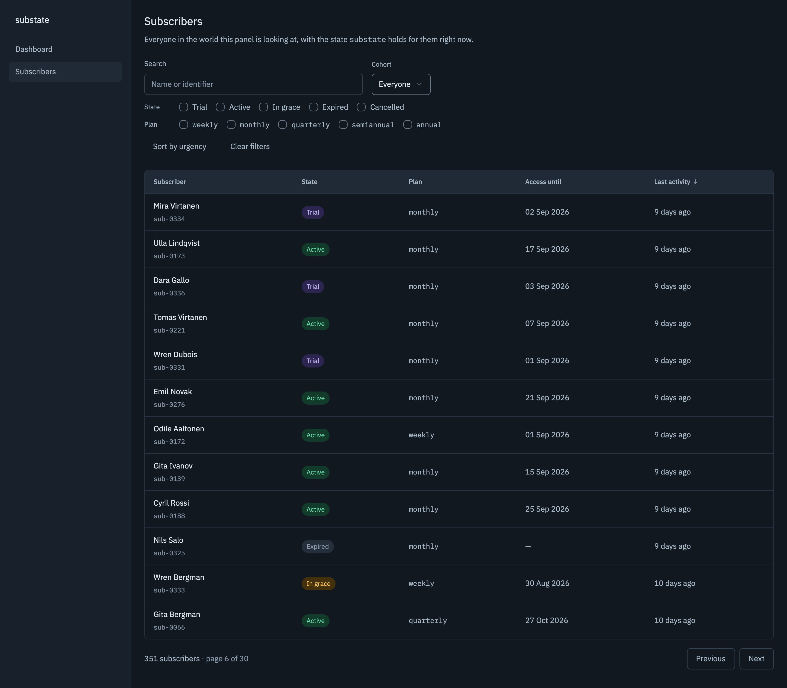

# substate-admin

[](https://github.com/umbrella-at/substate-admin/actions/workflows/ci.yml)

An admin panel for [substate](https://github.com/umbrella-at/substate): subscriptions as states
rather than invoices, for whoever has to answer what is happening to an account — and for whoever
is deciding whether the library is worth building on.



The picture is generated rather than taken. `npm --prefix frontend run capture` signs in to a
running copy, frames the same window every time and overwrites the file above.

## Live

<https://substate-admin.umbrella-at.uk> is the panel itself, so it opens on a sign-in screen.
`/api/health` needs no account, and answers with the release that is serving and the world behind
it:

```json
{ "status": "ok", "version": "0.1.0", "commit": "840edf8", "db": true,
  "world": { "seeded": true, "subscribers": 351, "events": 3731 } }
```

## What it does

**Worlds, each with its own clock.** Every read of subscription data goes through a world: its own
`substate` engine, its own storage, its own clock. That clock is real time with an offset laid over
the top, and it only ever moves forward — backwards is refused rather than clamped, because a
subscription's due date is compared against now and moving now backwards reaches states the engine
could never have arrived at by itself. A world nobody is looking at keeps running: a background
tick every thirty seconds advances whatever has come due.

**A seeder that runs the engine.** Nine months of a subscription service, produced at every start
by running `substate` forward through 274 days rather than by inserting rows that look like a
history. The section below is about that run.

**An event journal.** Every event that run emitted — around 3,700 of them — lands in Postgres
keyed to the world it belongs to, written with `COPY` in the same transaction that deletes the
previous build. The world is rebuilt at every start, so the journal is replaced rather than
appended to, and a month of ordinary deploys does not leave half a million rows of dead history
behind.

**The subscriber table.** Five states, five plans, three cohorts, a search box, sorting and paging
— all answered by the server, which sends a page of twenty-five rather than three hundred rows for
the browser to sift. The state of a subscription is asked of the engine on every request; only the
display name and the last time somebody turned up come from the projection, and nothing caches the
first kind into the second.

**The question lives in the URL.** Filters, sort and page are read out of the address and written
back to it, and nothing keeps a second copy. So everybody in grace is a link that can be sent to a
colleague rather than a route described over a call, the back button walks the filters somebody
actually used, and a reload gives the same table back.

**Roles and permissions out of the database.** The router and the navigation ask whether a
permission is held, never which role holds it — roles are rows an administrator can edit, and
keying the interface on role codes would mean a role change could only take effect with a frontend
release. The catalogue is the backend's `permissions.py`, force-synced into the database on every
deploy.

FastAPI on async SQLAlchemy over PostgreSQL 18, Vue 3.5 and TypeScript on Tailwind v4, and
`schema.d.ts` generated from the backend's own OpenAPI document — both files committed, and CI
fails when either stops matching the other.

## The history behind the numbers was not written by hand

The demonstration data is the part of a panel like this that is usually a lie. A few hundred rows
of plausible-looking subscriptions get inserted by a script, and every screen built on top of them
is a screen that cannot be wrong, because nothing in it was ever computed.

Here the history is produced by running the engine. At every start the panel creates a world whose
clock sits 274 days in the past, and steps it forward day by day: people sign up, trials convert or
lapse, payments arrive before a period ends and renew it, some arrive during the grace window and
rescue it, some never arrive at all. Nothing writes a state: every state on the screen is one the
engine reached by itself, and if it changes its mind about what a payment before a period ends
means, this history changes with it.

**The run is deterministic.** One seed, one sequence of decisions, the same 351 people in the same
order on every machine — and it costs about a seventh of a second, which is what lets it happen at
every start rather than once into a fixture nobody regenerates. The clock it runs on is the one the
panel uses, started at an offset of minus nine months and stepping to exactly zero: a negative
starting offset is not a backwards move, so the fast-forward is exercised nine months' worth before
anybody builds a control for it.

**The population is calibrated, and the calibration is the interesting part.** The behaviour that
drives the run — arrivals ramping over the nine months, 26% of trials converting, 89% of active
subscribers paying for the next period, 7% a day of the grace window ending in a payment, 7% a day
of the expired coming back — was moved until the table at the end looked like a service somebody
uses. The first run had 58% of subscribers expired and nobody at all in grace: a graveyard, with an
empty filter on the one state the design says means *call today*. An earlier attempt at filling
grace dropped renewal to 55%, which filled it by making the product fail — the median subscriber
renewed twice, and seven in ten had lapsed at least once.

**A test asserts the ranges rather than the numbers.** Exact counts break on any change to the
model and train you to edit the test instead of thinking; ranges catch the thing that matters,
which is a population drifting out of the shape that makes the screen worth looking at.

Comments in the code say what breaks if the line beside them changes. The reasoning behind a
decision is in the pull request that made it.

## Run it locally

Docker for Postgres, [uv](https://docs.astral.sh/uv/) for the backend — it fetches the interpreter
the project pins, so there is no Python to install first — and Node 24, which `.nvmrc` names.

Three commands, from the repository root:

```sh
docker compose up -d                                       # PostgreSQL 18 on 127.0.0.1:5432
uv run --directory backend uvicorn app.main:app --reload   # http://127.0.0.1:8000/api/health
npm --prefix frontend run dev                              # http://127.0.0.1:5173
```

The API builds the demonstration world while it starts, so the second command is also the one that
produces the 351 subscribers.

First time, before those three work — the schema, the permission catalogue, an account to sign in
as, and the dependencies the SPA is built from:

```sh
cp backend/.env.example backend/.env   # a DSN, two secrets and three switches, all
                                       # described in the file itself
uv run --directory backend alembic upgrade head
uv run --directory backend substate-admin sync-permissions
uv run --directory backend substate-admin create-user --email you@example.com --role admin
npm --prefix frontend ci
```

`COOKIE_SECURE=false` is the one that catches people: Safari refuses a `Secure` cookie over
`http://localhost` without saying so, and the panel logs in and then cannot refresh.

Everything CI checks, in one command:

```sh
./scripts/gate.sh
```

It exits `0` when every check ran and passed, `1` when one failed, and `2` when one could not run
at all — no database, no API, no docker. A gate that quietly skipped those would report success for
a run that proved less than the last one.

## What this is not

- **Not a second product.** It exists to show what [substate](https://github.com/umbrella-at/substate)
  can do. Every decision here is settled in substate's favour.
- **Not a payment gateway.** It never touches money, never talks to a payment provider, and stores
  no card data. Subscriptions here are state machines, not invoices.
- **Not a billing panel for a real business.** It is not hardened, audited, or supported for
  production operation, and it is not intended for it.
- **Not a dashboard of decorative charts.** There is no number in this project that is not backed
  by a real substate event.

## substate

The engine this is a window onto: [github.com/umbrella-at/substate](https://github.com/umbrella-at/substate),
`pip install substate`. Trials, renewals, grace periods, promo codes and referrals, with an
injectable clock — which is why nine months of history here costs a seventh of a second.

## Licence

MIT — see [LICENSE](LICENSE). Copyright (c) 2026 Andrei Tarunin.
